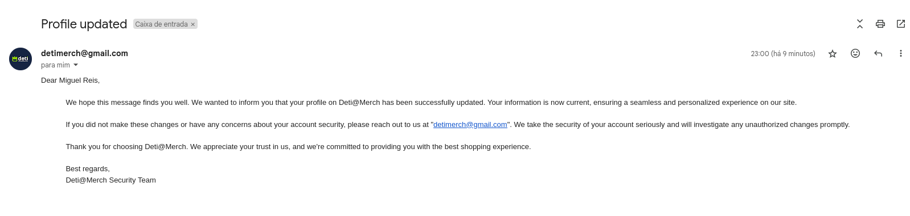

# Segundo projeto -SIO 

## Index 

1. Introdução 

2. ASVS 

- 2.1.2 

- 2.1.7 

- 2.1.8 

- 2.2.1 

- 2.2.3 

- 3.2.3 e 3.4.X 

- 3.3.2 

- 4.2.2 e 13.2.3 

- 4.3.1 

- 5.3.6 

- 8.3.2 

- 11.1.4 

- 14.2.3 e 10.3.2

3. Features

4. Conclusão 

## 1. Introdução 

De modo a dar continuidade ao trabalho realizado no primeiro projeto analisámos os principais problemas de segurança deste com auxílio do documento Excel disponibilizado pelos docentes da UC que continha a lista de ASVS v4.0.2.<br>
Com esta análise chegamos aos principais problemas do site desenvolvido.<br> 
No desenvolvimento deste projeto procuramos resoler os problemas identificados para tornar o nosso site o mais seguro possível tanto para um normal utilizador como proteger contra possiveis atacantes. 

## 2. ASVS 

Entre as vulnerabilidades que o nosso site apresenta estas são as que considerámos mais urgentes de serem corrigidas devido ao nível de comprometimento em que podem deixar um utilizador ou o próprio site.

## ASVS - 2.1.2 

A ASVS - 2.2.1 consiste em criar uma verificação para o número de caracteres possíveis de serem aceites em uma password de um utilizador. De modo a uniformizar e a garantir a segurança dos utilizadores as passwords permitidas têm de ter entre 12 a 128 caracteres. 
Escolhemos esta ASVS pois é importante que todos os utilizadores tenham uma password devidamente extensa para por consequência se tornar mais segura.

### Demonstração 

De modo a regular o número máximo de caracteres usados em passwords de utilizadores foi implementado uma verificação no ato de registo dos utilizadores e no ato de alteração de passwords.

```python 
if len(user.password) < 12: 
	flash('Password must have at least 12 characters.') - 13.2.3 
	return redirect(url_for('profile.edit_profile')) 
elif len(user.password) > 128: 
	flash('Password must have less than 128 characters.') 
	return redirect(url_for('profile.edit_profile')) 
``` 
## ASVS - 2.1.7 

A ASVS - 2.1.7 garante que não são consideradas válidas passwords que pertençam à lista das 10.000 passwords mais comuns do mundo (PASSWORDS.txt).
Escolhemos esta ASVS para garantir que a password do user não é descoberta com demasiada facilidade por ser considerada muito previsível.

## Demonstração 

	Demonstração da implementação e verificação do que foi enunciado a cima:

```python
@auth.route('/register', methods=['POST'])
def register_post():
    username = request.form.get('username')
    email = request.form.get('email')
    password = request.form.get('password')
    confirm_password = request.form.get('confirm_password')
    user = User.query.filter_by(username=username).first()
    user_email = User.query.filter_by(email=email).first()
    common_passwords = open('PASSWORDS.txt', 'r', encoding='utf-8')
``` 
```python
for line in common_passwords:
	common = []
	if password == line.strip():
		common.append(password)
		flash('Password has been found in data breaches. Please choose a different password.')
		return redirect(url_for('auth.register'))
```

## ASVS - 2.1.8 
A ASVS - 2.1.8 garante que é fornecido ao utilizador um strength meter para que este possa avaliar a qualidade da sua password e com isso ser influenciado a tomar uma melhor decisão.<br>
Escolhemos esta ASVS pois como não impomos outra restrição na criação de passwords (apenas limite mínimo e máximo de caracteres) o strength meter garante que o utilizador tenha conhecimento de quanto a sua password é vulnerável. 
## Demonstração 

Para a implementação desta mesma feature utilizamos o seguinte script:

```html 
<script>
	function checkPasswordStrength(password) {
	var hasUpperCase = /[A-Z]/.test(password);
	var hasLowerCase = /[a-z]/.test(password);
	var hasDigit = /\d/.test(password);
	var hasSpecialChar = /[!@#$%^&*()_+{}|:"<>?]/.test(password);
	var strength = 0;

	if (password.length >= 12 && hasUpperCase && hasLowerCase && hasDigit && hasSpecialChar) {
		strength = 2; // Strong
	} else if (password.length >= 8 && hasUpperCase && hasLowerCase) {
		strength = 1; // Moderate
	} else {
		strength = 0; // Weak
	}
	displayStrength(strength);
}
	function displayStrength(strength) {
		var strengthMeter = document.getElementById("password-strength");
		var strengthText;

		if (strength === 0) {
			strengthText = "Weak";
		} else if (strength === 1) {
			strengthText = "Moderate";
		} else if (strength === 2){
			strengthText = "Strong";
		}
		strengthMeter.textContent = "Password Strength: " + strengthText;
	}
</script>
``` 
## ASVS - 2.2.1 

A ASVS - 2.2.1 garante que o web service seja resistente contra ataques de brute force.
Escolhemos esta ASVS pois ataques deste género são bastante comuns e podem comprometer a segurança de um utilizador.

## Demonstração 

Para isso implementámos:

```python 
if user.failed_login_attempts >= 2:
	user.last_login_attempt = datetime.now() + timedelta(seconds=30) 
	flash(f'Please wait until {user.last_login_attempt.strftime("%H:%M:%S")} before trying again.') 
	db.session.commit() 
	return redirect(url_for('auth.login')) 
``` 
## ASVS - 2.2.3 

A ASVS - 2.2.3 consiste em enviar informação de forma segura aos utilizadores sempre que estes alterem informações no seu regiisto.<br>
A forma que escolhemos para enviar esta informação foi via email, assim o utilizador pode verificar que foram efetuadas alterações e caso não tenho sido o mesmo a fazê-las entrar em contacto com os proprietários do site.<br> 
De salientar que nenhuma informação sensivel é passada neste email.<br> 
 
## Demonstração 

A implementação foi feita de modo a que os utilizadores recebam um e-mail personalizado caso alterem a sua password ou qualquer outra informação no seu perfil. <br> 
Com isto os utilizadores estão mais seguros pois em caso de alteração indevida de informações do legitimo utilizador este poderá entrar em contacto com os proprietários do site para resolver rapidamente o seu problema. 

```python 
flash('Profile updated successfully!') 
msg = Message("Profile updated") 
msg.recipients= [current_email] 
msg.body = """Dear {username}, 

We hope this message finds you well. We wanted to inform you that your profile on Deti@Merch has been successfully updated. Your information is now current, ensuring a seamless and personalized experience on our site. 

If you did not make these changes or have any concerns about your account security, please reach out to us at "detimerch@gmail.com". We take the security of your account seriously and will investigate any unauthorized changes promptly. 

Thank you for choosing Deti@Merch. We appreciate your trust in us, and we're committed to providing you with the best shopping experience. 

Best regards, 
Deti@Merch Security Team 
""".format(username=user.username) 

mail.send(msg) 
db.session.commit() 
return redirect(url_for('profile.profile')) 
```
<br> 

## ASVS - 3.2.3 e 3.4.X 

A ASVS - 3.2.3 garante que a aplicação apenas guarda tokens de sessão no browser usando métodos seguros. <br> 
Escolhemos esta ASVS pois é importante garantir que os tokens de sessão são guardados de forma segura para evitar acessos não autorizados através dos mesmos. <br> 
De forma a garantir que a sessão do utilizador está corretamente protegida adicionámos também as seguintes variáveis de configuração que garantem também a implementação da secção 4 do capítulo 3 (Cookie-based Session Management). <br> 
Resolve também algumas ASVS relativas ao capítulo 14 (14.4.4, 14.4.6, 14.4.7). 

## Demonstração 

```python 
app.config['SESSION_TYPE'] = 'filesystem'  
app.config['SESSION_COOKIE_SECURE'] = True
app.config['SESSION_COOKIE_HTTPONLY'] = True 
app.config['SESSION_COOKIE_SAMESITE'] = 'Lax' 
app.config['SESSION_COOKIE_NAME'] = '_Host-detimerch_session' 
app.config['SESSION_COOKIE_PATH'] = '/' 
app.config['X-POWERED-BY'] = 'Detimerch' 
app.config['X-CONTENT-TYPE-OPTIONS'] = 'nosniff' 
app.config['X-FRAME-OPTIONS'] = 'SAMEORIGIN' 
app.config['Referrer-Policy'] = 'no-referrer' 
app.config['Cache-Control'] = 'no-cache, no-store, must-revalidate' 
app.config['Pragma'] = 'no-cache' 
``` 
## ASVS - 3.3.2 

A ASVS - 3.3.2 garante que um utilizador que se tenha logado com sucesso tenha de se autenticar novamente passado 1 dia após a sua última autenticação. <br> 
Considerámos importante limitar o tempo da sessão do utilizador pois em caso de roubo/furto de dispositivos que estejam autenticados no nosso site o deixem de estar rapidamente. 

## Demonstração 

```python 
app.config['PERMANENT_SESSION_LIFETIME'] = timedelta(days=1) 
``` 

## ASVS - 4.2.2 e 13.2.3
 
A ASVS - 4.2.2 garante que o site é seguro contra ataques de CSRF (Cross-Site Request Forgery), para isso foi implementado a criação de tokens anti-CSRF e assim sempre que um user faça qualquer request o site compara o token desse user e confirma se este é válido ou não.
Escolhemos esta ASVS pois os ataques por via de CSRF são bastante nocivos para os utilizadores e estão cada vez mais comuns nos dias de hoje, devido à ingenuidade dos utilizadores. Para teste desta ASVS foi usado a ferramenta OWASP ZAP e o Burp Suite.

## Demonstração 

Exemplo de uma das implementações para a criação e verificação destes tokens:
```python
class RegisterForm(FlaskForm):
    username = StringField('Username', validators=[DataRequired()])
    email = StringField('Email', validators=[DataRequired()])
    password = PasswordField('Password', validators=[DataRequired()])
    confirm_password = PasswordField('Confirm Password', validators=[DataRequired()])
    submit = SubmitField('Register')
```
```html
<form action="/register" method="post">
        {{reg.csrf_token}}
        <div class="main">
            <div class="main-login"></div>
            <div class="log">
                <h2>Cria já a tua conta</h2>

                <div class="textfield">
                    {{reg.username.label}}
                    {{reg.username(class="form-control", placeholder="Enter Username")}}
                    
                        <span class="text-danger">{{ error }}</span>
                    
                </div>

                <div class="textfield">
                    {{reg.email.label}}
                    {{reg.email(class="form-control", placeholder="Enter Email")}}
                    
                        <span class="text-danger">{{ error }}</span>
                    
                </div>

                <div class="textfield">
                    {{reg.password.label}}
                    {{reg.password(class="form-control", placeholder="Enter Password", onkeyup="checkPasswordStrength(this.value)")}}
                    
                        <span class="text-danger">{{ error }}</span>
                    
                    <div id="password-strength"></div>
                </div>

                <div class="textfield">
                    {{reg.confirm_password.label}}
                    {{reg.confirm_password(class="form-control", placeholder="Confirm Password")}}
                    
                        <span class="text-danger">{{ error }}</span>
                    
                </div>
```
```python
@auth.route('/register')
def register():
    reg = RegisterForm()
    if current_user.is_authenticated:
        return redirect(url_for('main.index'))
    else:
        return render_template('register.html', reg=reg)
```

## ASVS - 4.3.1 

A ASVS - 4.3.1 garante que para ter acesso à conta de um determinado utilizador este tenha de passar por um processo de autenticação multifatorial.<br>
Para isso usámos o TOTP authentication login que através de one-time passwords autentica os utilizadores.<br>
Ao criar um perfil na nossa web-app o utilizador é apresentado um Qrcode ao utilizador, que ao dar scan com uma aplicação de autenticação (como o google authenticator ou a Authy por exemplo) fica com acesso a essas mesmas one-time passwords.<br>
Escolhemos esta ASVS pois a autenticação multifator é um método crucial para prevenção de roubo de contas.

## Demonstração 
Foi implementado o sistema de MFA recorrendo à biblioteca do python pyotp e qrcode.<br> 
A biblioteca pyotp é usada tanto para a criação das one-time passwords como para a verificação de que os códigos introduzidos pelos utilizadores são válidos. 

```python 
else: 
	flash('Account successfuly created.') 
	new_user = User(username=username, email=email, password=generate_password_hash(password, method='sha256')) 
	db.session.add(new_user)
	key= pyotp.random_base32()
	totp= pyotp.TOTP(key).provisioning_uri(username, issuer_name="Detimerch")
	encrypted_key=encrypt_key(key, username, password)
	print(password)
	new_user.key=encrypted_key
	dir_path = os.path.dirname(os.path.abspath(__file__))
	qrcode.make(totp).save(os.path.join(dir_path, "static/assets/QR.png"))
	db.session.commit()
``` 
```python
def login_post(): 
	user = User.query.filter_by(username=username).first() 
	facode = request.form.get('2facode') 
	totp= pyotp.TOTP(user.key) 
if not user: 
	flash('Please check your login details and try again.') 
	return redirect(url_for('auth.login')) 
else:
	if check_password_hash(user.password, password):
            encrypted_key = user.key
            decrypted_key = decrypt_key(encrypted_key, username, password)
            totp = pyotp.TOTP(decrypted_key)
            if totp.verify(twofa_code):
                if user.failed_login_attempts >= 2:
                    if user.last_login_attempt and user.last_login_attempt > datetime.now():
                        flash(f'Please wait until {user.last_login_attempt.strftime("%H:%M:%S")} before trying again.')
                        return redirect(url_for('auth.login'))
                    elif user.last_login_attempt and user.last_login_attempt <= datetime.now():
                        flash('Your account is now unlocked.')
                        user.reset_failed_login_attempts()
                        db.session.commit()
                        time.sleep(0.1)
```
## ASVS - 5.3.6 

A ASVS - 5.3.6 garante que a aplicação está protegida contra JavaScript ou JSON injection.<br>
Escolhemos esta ASVS pois o search por produtos era o único lugar onde o  input do utilizador não era devidamente analisado antes de ser renderizado na página, tornado assim possível ataques de XSS mais avançados.

## Demonstração 

A nossa aplicação não estava completamente protegida contra ataques deste género no campo de pesquisa por produtos. <br> 
Para suprir essa vunerabilidade adicionámos uma camada extra de proteção com o seguinte excerto de código: 

```html
function displayProductCards(products) { 
let html = ""; 
var userInput = $("#search").val(); 
var sanitizedUserInput = $("<div>").text(userInput).html(); 
$("#search_result").html( 
"Search results for: <strong>" + sanitizedUserInput + "</strong>"); 
} 
```

## ASVS - 11.1.4 

A ASVS - 11.1.4 garante que a aplicação está protegida contra excessivos request simultâneos que podem causar falha nos recursos da mesma. <br> 
Considerámos esta ASVS um key issue a ser resolvido pois proteção contra pedidos excessivos na aplicação o que poderia levar a sobrecarga da mesma. Para o teste desta ASVS foi usado a ferramenta curl para fazer pedidos em massa.

## Demonstração 
Para garantir o controlo de request implementámos o seguinte limite com recurso à biblioteca flask-limiter: 

```python 
limiter = Limiter(key_func=get_remote_address, default_limits=["200 per day", "50 per hour"])

limiter.limit("500 per day")(cart_blueprint)
limiter.limit("50 per day")(auth_blueprint)
``` 

## ASVS - 14.2.3 e 10.3.2

A ASVS - 14.2.3 garante que todos os serviços externos à aplicação são validados em termos de integridade. <br> 
Escolhemos estas ASVS's como um dos key issues de forma que todos os recursos externos ao nosso site não possam ser falsificados, garantindo que não teremos qualquer tipo de problema de segurança por parte de recursos externos utilizados. 

## Demonstração 
Exemplo de como a verificação de integridade foi feita: 
```html 
<link 
	href="https://cdn.jsdelivr.net/npm/bootstrap@5.2.3/dist/css/bootstrap.min.css" 
	rel="stylesheet" 
	integrity="sha384-rbsA2VBKQhggwzxH7pPCaAqO46MgnOM80zW1RWuH61DGLwZJEdK2Kadq2F9CUG65" 
	crossorigin="anonymous" 
/> 
``` 

## 3. Features

Da lista de features apresentadas pelos docentes implementámos as seguintes:

- Password Strength Evaluation

	- Foi implementado o password strength meter de modo a avaliar a segurança da password introduzida cumprindo as ASVS (minimo e máximo de caracteres) fazendo a verificação destas passwords com recurso à API Have I Been Pwned.

	- O strength meter é apresentado aos utilizadores tanto no processo de criação de conta como quando é efetuada a alteração da password.

- Multi-factor Authentication

	- Implementámos a autenticação multifator com recurso à biblioteca pyotp de modo a usar temporary one-time passwords para autenticar os utilizadores no nosso site.

	- Ao criar um perfil na nossa web-app o utilizador é apresentado a um Qrcode que ao dar scan com uma aplicação de autenticação (como o google authenticator ou a Authy por exemplo) fica com acesso a essas mesmas one-time passwords. Este Qrcode é gerado através de uma key que é armazenada na base de dados de forma cifrada e que mais tarde é usada no processo de login para verificar a TOTP inserida.

- Encrypted database storage

	- Todos os dados críticos guardados na database são devidamente cifrados.

	- Dados Cifrados: Password do utilizador e key para a autenticação multifator.

## 4. Conclusão 

Ao realizar este projeto de continuação, conseguimos identificar várias falhas graves de segurança que ainda estavam presentes na nossa versão passada de um site "seguro". <br> 
Com isto concluimos que criar um site que proteja devidamente os interesses dos seus utilizadores e proprietários e mesmo assim seja user friendly se torna uma tarefa bastante desafiante pois a quantidade de métodos de atacar um site/aplicação atualmente são inumeros e só com uma boa equipa de segurança a trabalhar ativamente em prol do bom funcionamento do produto final é que se consegue garantir um minimo de segurança. 